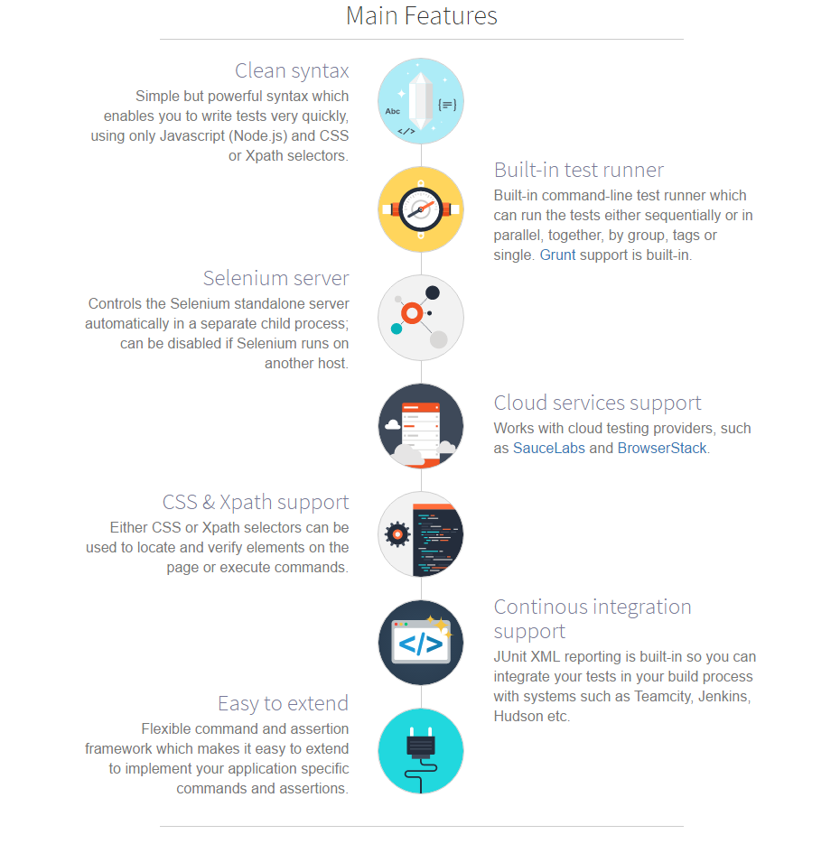

# Test Tool Study Report
End to End testing of React apps with Nightwatch

### 3. Overview about Nightwatch.js solution

#### a. Overview
 
 Nightwatch.js is an easy to use Node.js based End-to-End (E2E) testing solution for browser based apps and websites. It uses the powerful W3C WebDriver API to perform commands and assertions on DOM elements.
 
#### b. Main Features

### 4. Demo using Nightwatch.js in Auto Testing Login in Stars

#### a. How to Write Codes
##### i. Installation
You will `need`:
- [Java v8](https://java.com/en/download/)
- [Java Development Kit](http://www.oracle.com/technetwork/java/javase/downloads/jdk8-downloads-2133151.html)

As they are all required for `Selenium` and `Nightwatch` to work properly.

Go to your terminal run: 

`npm install`

`npm run setup` 

It will download the latest version of selenium server and browser driver
##### ii. Configuration

Nightwatch relies on `nightwatch.json` as the configuration file for the test runs. It should be placed in projects root directory. It specifies various configuration settings like test environments (browsers, resolutions), test file paths and selenium-specific settings. This is how the configuration file can look like:

```javascript
{
  "src_folders": ["tests"],
  "output_folder": "reports",
  "custom_assertions_path": "",
  "page_objects_path": "pages",
  "globals_path": "./globals",

  "selenium": {
    "start_process": true,
    "server_path": "./node_modules/selenium-standalone/.selenium/selenium-server/2.53.1-server.jar",
    "log_path": "./reports",
    "host": "127.0.0.1",
    "port": 4444,
    "cli_args": {
      "webdriver.chrome.driver": "./node_modules/selenium-standalone/.selenium/chromedriver/2.25-x64-chromedriver",
      "webdriver.ie.driver" : "./node_modules/selenium-standalone/.selenium/iedriver/2.53.1-x64-IEDriverServer.exe"
    }
  },
  "test_settings": {
    "default": {
      "launch_url": "http://localhost:7811/auth",
      "selenium_port": 4444,
      "selenium_host": "localhost",
      "silent": true,
      "screenshots": {
        "enabled": false,
        "path": ""
      },
      "desiredCapabilities": {
        "browserName": "chrome",
        "javascriptEnabled": true,
        "acceptSslCerts": true,
        "version":"latest"
      }
    },
    "chrome": {
      "desiredCapabilities": {
        "browserName": "chrome",
        "javascriptEnabled": true,
        "acceptSslCerts": true,
        "version":"latest"
      }
    },
    "firefox": {
      "desiredCapabilities": {
        "browserName": "firefox",
        "javascriptEnabled": true,
        "acceptSslCerts": true,
        "version":"latest"
      }
    },
    "ie": {
      "desiredCapabilities": {
        "browserName": "internet explorer",
        "javascriptEnabled": true,
        "acceptSslCerts": true,
        "version":"latest"
      }
    }
  }
}

```

I'll go through the important parts of the `nightwatch.json` file:

* `src_folders` - an array that contains the folders that your tests reside in
* `output_folder` - folder where the test artifacts (XML reports, selenium log and screenshots) are being stored
* `page_objects_path` - a folder where your Page Objects will be defined
* `globals_path` - path to a file which stores global variables
* `selenium` - selenium specific settings. In our case it's important to have the `start_process` set to `true` so that selenium server starts automatically. Also the `server_path` and `webdriver.chrome.driver` paths should have proper folder specified.

`test_settings` is an object where you specify the test environments (include `chrome`, `firefox`, `ie` ...). The important bit in the `default` environment is the `desiredCapabilities` object where we specify the `chrome` as the `browserName` so that Nightwatch will run the test against it.

##### iii. Configuration Adding ECMAScript 6 to nightwatch

To use ECMAScript 6, i will have to add a `nightwatch.conf.js` file to the root of your project. The file should contain these couple of lines:

```javascript
require('babel-core/register');

module.exports = require('./nightwatch.json');
```

##### iv. The Tests login

###### - In folder `tests/login`. 

I have 4 files correspond to 4 cases login:

Eg: `testCase1.js` test that is check case "User Log in Email Blank"

```javascript
export default {
	'@tags': ['login'],
  	'User Log in Email Blank': (client) => {
		const loginPage = client.page.loginPage();
		const constantsLogin = client.globals.constantsLogin;
		const waitForAPICallback = client.globals.waitForAPICallback;
		loginPage
			.navigate()
			.login( constantsLogin.emailBlank, constantsLogin.passwordPass)
			.assert.value('@emailInput', '');
		client.pause(waitForAPICallback);
		loginPage
			.assert.cssProperty("@emailInput", "color", "rgba(255, 0, 0, 1)");
		client.end();
	  }
};
```

* `'@tags': ['login']` for filter test modules by tags. (I will loaded all specified tags is `login`).
* `client.page.loginPage();` get value of `pages/loginPage.js` (folder `pages` imported by `"page_objects_path": "pages"` in `nightwatch.json`)
* `client.globals.constantsLogin;` value object `constantsLogin` in file `globals.js` (file `globals.js` import by `"globals_path": "./globals"` in `nightwatch.json`).
* `.assert.value('@emailInput', '');` pass if `email = ''`.
* `client.pause(waitForAPICallback);` delay 4s for wait API Callback.
* `loginPage.assert.cssProperty("@emailInput", "color", "rgba(255, 0, 0, 1)");` pass if css of `<input type="email">` has `color:rgba(255, 0, 0, 1)`
* `client.end()` method ends the browser session

The way to achieve this sort of clarity within a test, where the business logic is presented clearly and test can be easily understood even by non tech-saavy people is by introducing the Page Object pattern. `loginPage` and `mainPage`(page redirect apter login success) objects contain all the methods and ui elements that are needed to make interactions within that page.

###### - Log in Page Object
Page Objects files should be created in a `pages` folder. Create one in the root of your project. Next, create a `loginPage.js` file that will contain this code:

```javascript
const loginCommands = {
  login(email, pass) {
    return this
      .setValue('@emailInput', email)
      .setValue('@passInput', pass)
      .click('@loginButton')
  }
};

export default {
  url: 'http://localhost:7811/auth',
  commands: [loginCommands],
  elements: {
    emailInput: {
      selector: 'input[type=text]'
    },
    passInput: {
      selector: 'input[name=password]'
    },
    loginButton: {
      selector: '//button[@class="pb-button"]',
   		locateStrategy: 'xpath'
    },
    message: {
      selector: '//div[@class="message-bin"]',
      locateStrategy: 'xpath'
    }
  }
};

```

The file contains an object loginCommands that stores a `login` method. The `login` method waits for an email input element to be visible, sets the values of email and password fields, waits for login button to be visible and finally clicks the button.

A part from the `loginCommands` there's a second object defined below which is  actually the Page Object that we instantiate in the `testCase-.js` file with this line:

`const loginPage = client.page.loginPage();`

as you can see the Page Object contains:

* the pages url (when `navigate()` method in the test is called it uses this url as a parameter)
* `commands` property where we pass the `loginCommands` object defined above, so that the `login` method can be used within this page's context
* `elements` property where the actual selectors for making interactions with the web page are stored

As you've probably noticed there's an `@` prefix used before the locators both inside the test and in the loginCommands object. This tells Nightwatch that it should refer to the key declared in the `elements` property inside the Page Object.

###### - Main Page Object

File `pages/mainPage.js`. It should contain the following code:

```javascript
export default {
  elements: {
    main: {
      selector: '//button[@class="logoutBtn ylopo-button"]',
      locateStrategy: 'xpath'
    }
  }
};

```

You can use XPath selectors by adding a `locateStrategy: xpath` property to the desired element.

The `main` element is used in the 12 line of the `testCase4.js` file to assert if a login was successful.

```javascript
    mainPage.expect.element('@main').to.be.visible;
```
#### b. Run the Demo

Run this command:

`node nightwatch.js --tag login`

It will running all file have `'@tags': ['login']` in default browser

If running with multi browser, type : `node nightwatch.js -e default,firefox,ie --tag login`

console output similar to this one:

```
Starting selenium server... started - PID:  10444

[Login\test Case1] Test Suite
=================================

Running:  User Log in Email Blank
 √ Testing if value of <input[type=text]> equals: "".
 √ Testing if element <input[type=text]> has css property "color: rgba(255, 0, 0, 1)".

OK. 2 assertions passed. (12.688s)

[Login\test Case2] Test Suite
=================================

Running:  User Log in Password Blank
 √ Testing if value of <input[name=password]> equals: "".
 √ Testing if element <input[name=password]> has css property "color: rgba(255, 0, 0, 1)".

OK. 2 assertions passed. (12.348s)

[Login\test Case3] Test Suite
=================================

Running:  User Log in error email or password
 √ Testing if element <//div[@class="message-bin"]> contains text: "Invalid username or password.".

OK. 1 assertions passed. (12.896s)

[Login\test Case4] Test Suite
=================================

Running:  User Log in success
 √ Expected element <//button[@class="logoutBtn ylopo-button"]> to be visible - condition was met in 85ms

OK. 1 assertions passed. (12.238s)

OK. 6  total assertions passed. (50.709s)

```

Detail report will save in folder `reports/login`

Well done! 

### 5. Assessment and QA Proposal
### 6. Reference
- [syncano.io](https://www.syncano.io/blog/testing-syncano/)
- [nightwatchjs](http://nightwatchjs.org/)

